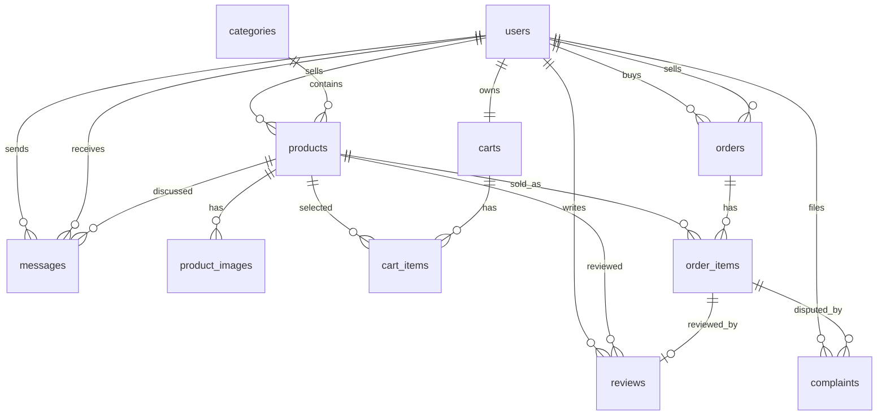

# TechSecond ERD v2

Nguồn chân lý schema là Laravel migrations trong `database/migrations`.

Ghi chú:

- `orders` đại diện một buyer và một seller. Checkout multi-seller phải tạo nhiều order.
- `order_items` lưu snapshot `product_name`, `unit_price`, `subtotal`.
- Review và complaint gắn với `order_item`.
- Product dùng soft delete.
